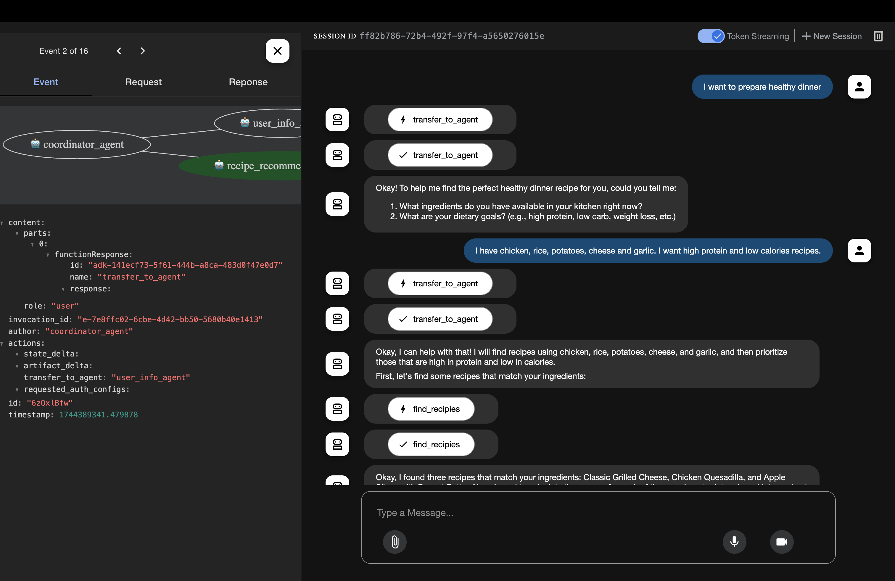

# Chef's Kiss

Agentic application for suggesting recipes based on user preferences and dietary restrictions.
It uses the [Google Agentic Development Kit (ADK)](https://google.github.io/adk-docs/) to create a conversational agents that can interact with users and provide personalized recipe suggestions.

## Install

Make sure you have [`uv` installed](https://docs.astral.sh/uv/getting-started/installation/).

Clone the repository:

```bash
git clone git@github.com:curiousily/chefskiss.git .
cd chefskiss
```

Install Python:

```bash
uv python install 3.12.10
```

Create and activate a virtual environment:

```bash
uv venv
source .venv/bin/activate
```

Install dependencies:

```bash
uv sync
```

## Run Ollama

Chef's Kiss uses Ollama for LLM inference by default. Watch this video to see how to install Ollama: https://www.youtube.com/watch?v=lmFCVCqOlz8

The default model is Qwen 2.5 7B:

```bash
ollama pull qwen2.5
```

Feel free to experiment with other models.

## Gemini API Key

Or you can use the Gemini API. To add your API:

```bash
mv chefskiss/.env.example chefskiss/.env
```

Then, open `chefskiss/.env` and add your API key:

```bash
GOOGLE_API_KEY=your_api_key
```

## Run the web app

Run the app:

```bash
adk web
```
